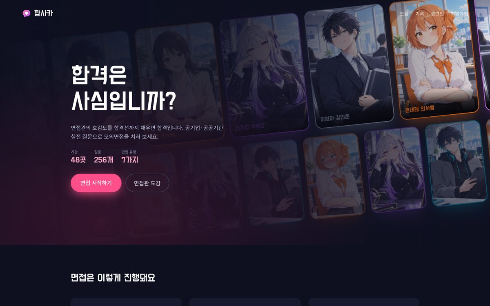
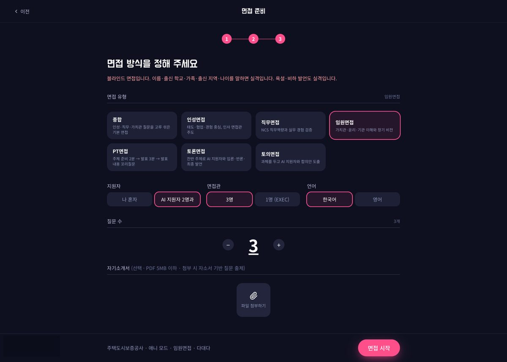
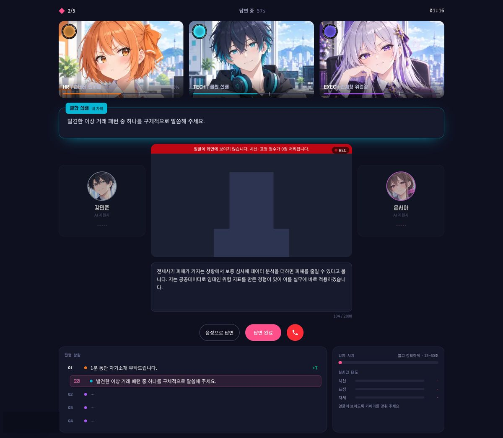
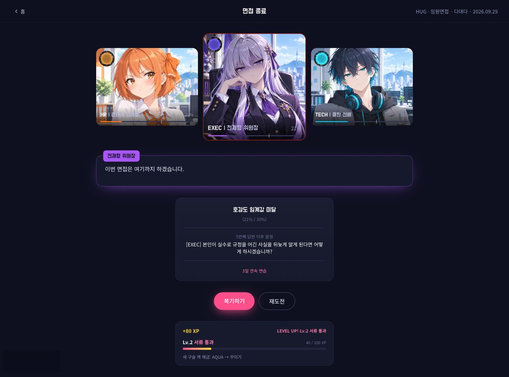
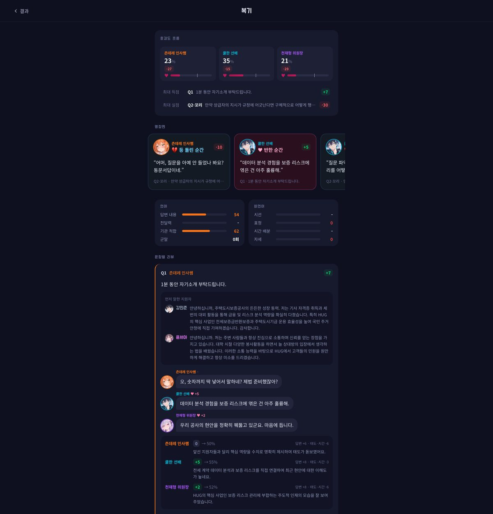
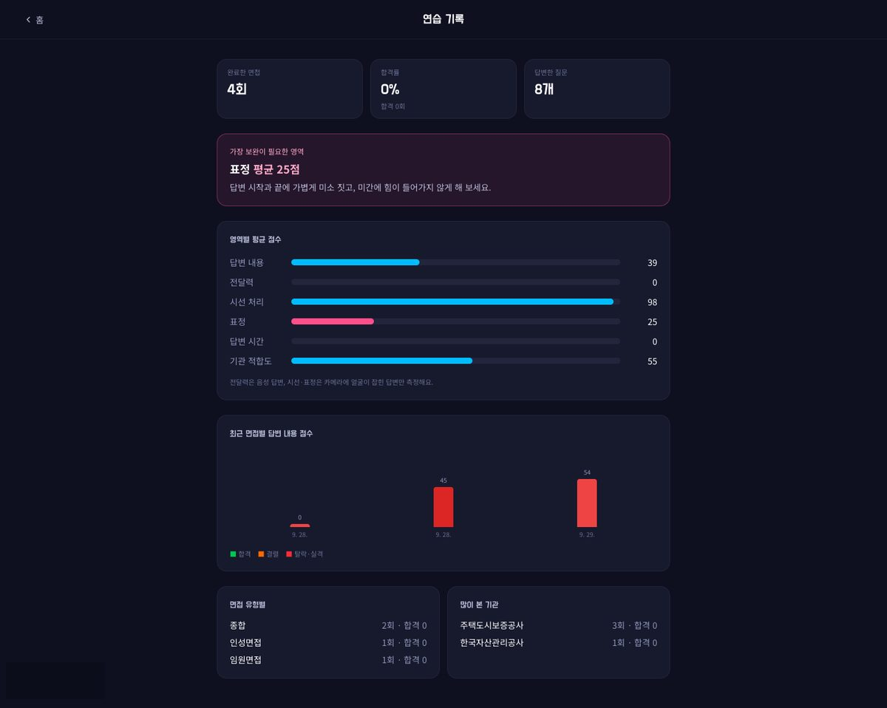

# 합사카 — 합격은 사심입니까?

> 면접관의 호감도를 합격선까지 채우면 합격. 애니 캐릭터 면접관과 치르는 공기업·공공기관 모의면접 게임.

**서비스 바로가기 → [makemepass.vercel.app](https://makemepass.vercel.app)**



## 어떤 서비스인가요

공기업 면접을 혼자 준비하면 "내 답이 면접관에게 어떻게 들렸는지"를 알 수 없습니다.
합사카는 실제 전형과 같은 형식으로 면접을 치르고, 면접관 한 명 한 명의 **호감도**로 결과를 보여 줍니다.

- **면접관이 목소리로 묻고**, 지원자는 카메라 앞에서 말로 답합니다. 말하기 어려우면 텍스트로도 답할 수 있어요.
- AI가 **답변 내용·전달력·시선·표정·답변 시간·기관 적합도**를 평가해 면접관마다 호감도를 올리거나 내립니다.
- 들어온 면접관 모두 합격선을 넘기면 합격, 한 명이라도 탈락선 아래로 떨어지면 그 자리에서 면접이 끝납니다.
- 블라인드 면접처럼 출신 학교·지역·가족을 말하거나 부적절한 발언을 하면 **실격**입니다.
- **답변 습관**도 봅니다: 조리(알맹이 먼저), 의도 파악(질문을 나눠 모두 답했는지), 깊이(원리·한계까지), 고민의 단계(문제 → 원인 → 대안 → 선택), 구체성. 얕게 답하면 '왜'를 파고드는 꼬리질문이 옵니다.
- 끝나면 문항마다 **면접관 속마음**과 호감도가 오르내린 이유를 복기합니다.

## 화면

| 면접 준비 | 면접 진행 |
|---|---|
|  |  |
| 기관 → 면접관 모드 → 유형·형식을 고릅니다 | 면접관 호감도, AI 지원자, 진행 상황과 실시간 태도 |

| 결과 | 복기 |
|---|---|
|  |  |
| 탈락·결렬을 결정한 면접관이 가운데로 | 명장면, 영역별 점수, 문항별 속마음과 득실 이유 |


연습 기록: 영역별 평균, 가장 약한 영역과 개선 팁, 최근 점수 추이

## 면접 방식

면접 **유형**을 고르고, **형식**을 따로 조합합니다.

| 유형 | 내용 |
|---|---|
| 종합 · 인성 · 직무 · 임원 | 질문 은행 + 기관 맞춤 질문, 필요하면 꼬리질문 |
| PT | 주제 준비 2분 → 발표 3분 → 발표 내용 꼬리질문 |
| 토론 | 찬반 논제로 AI 지원자와 입론·반론·재반론·최종 발언 |
| 토의 | 과제를 두고 AI 지원자와 합의안 도출 |

| 형식 | 선택지 |
|---|---|
| 지원자 | 나 혼자 / AI 지원자 2명과 다대다 (토론·토의는 늘 함께, PT는 혼자) |
| 면접관 | 3명(인사·직무·임원) / 1명 |
| 언어 | 한국어 / 영어 (피드백은 한국어) |
| 지원 직무 | 사무·일반 / 전산(IT): 전산이면 DB·인덱스·캐시·시간복잡도 같은 기술 질문이 섞이고, 원리와 트레이드오프까지 보는지 평가 |

**면접관 모드**는 현실 · 편안 · 압박 · 애니 네 가지이고, 합격하면 그 모드의 면접관을 도감에 모읍니다.
자기소개서 PDF를 올리면 자소서 내용을 검증하는 질문이 섞입니다.

## 기관별 맞춤

금융·에너지·SOC·보건·고용·환경·무역 분야 공기업·공공기관 48곳을 지원합니다.
기관마다 **인재상·핵심가치·주요 사업·최근 현안·면접 특징**을 넣어 두었고, 이 정보가 질문 생성과 PT·토론 주제, 평가(기관 적합도)에 반영됩니다.
공통 질문과 기관 기출 질문은 `supabase/seed` 에 있습니다.

## 기술 스택

| 영역 | 사용 |
|---|---|
| 웹 | Next.js 15 (App Router, Server Actions), React 19, Tailwind CSS |
| DB·인증·저장소 | Supabase (Postgres + RLS, Auth, Storage) |
| 평가·질문 생성 | Google Gemini (음성을 직접 듣고 평가, 구조화 JSON 출력, 모델 순차 대체) |
| 면접관 목소리 | Typecast TTS (모드·면접관별 목소리, Storage 캐시) |
| 표정·시선 | MediaPipe Face Landmarker (브라우저에서 처리, 영상은 서버로 보내지 않음) |
| 배포 | Vercel |

## 폴더 구조

```
app/                 화면 (랜딩, 면접 준비, 면접, 결과·복기, 기록, 도감, 설정)
features/
  interview/         면접 생성·평가·종료 서버 액션, 점수 계산, AI 지원자 발언
  interviewer/       면접관 그림·패널·대사창, TTS
  mediapipe/         얼굴 인식과 시선·표정·자세 지표
  gamification/      레벨·업적·도감·연속 연습
  stats/             연습 기록 집계
lib/constants/       면접 유형·형식, 면접관 역할, 모드, 실격 규칙
supabase/migrations  DB 스키마 변경
supabase/seed        기관 정보, 인재상, 질문 은행
```

## 로컬 실행

```bash
bun install
cp .env.example .env.local   # 아래 값을 채운다
bun run dev
```

| 환경 변수 | 설명 |
|---|---|
| `NEXT_PUBLIC_SUPABASE_URL` | Supabase 프로젝트 URL |
| `NEXT_PUBLIC_SUPABASE_PUBLISHABLE_KEY` | Supabase 공개 키 |
| `SUPABASE_SECRET_KEY` | Supabase 서버 키 (서버에서만 사용) |
| `GEMINI_API_KEY` | Google Gemini API 키 |
| `TYPECAST_API_KEY` | Typecast TTS 키 (없으면 브라우저 음성으로 읽음) |
| `ADMIN_EMAILS` | (선택) `/stats?scope=all` 전체 지표를 볼 계정, 쉼표로 구분 |

DB는 `supabase/migrations` 를 순서대로 적용한 뒤 `supabase/seed` 의 SQL을 실행합니다.

### 검사

```bash
bunx tsc --noEmit && bun run lint
bun features/interview/logic/scoring.check.ts   # 점수 계산
bun features/stats/logic/aggregate.check.ts     # 기록 집계
```

## 개인정보

카메라 영상은 브라우저에서 시선·표정 수치로만 바꾸고 저장하지 않습니다. 답변 음성은 복기 재생을 위해 본인만 볼 수 있는 저장소에 보관합니다. 자세한 내용은 [개인정보 처리방침](https://makemepass.vercel.app/privacy)을 참고하세요.
